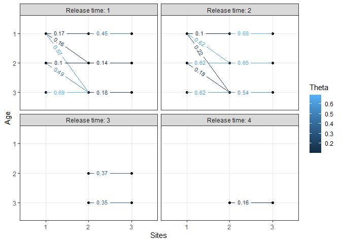
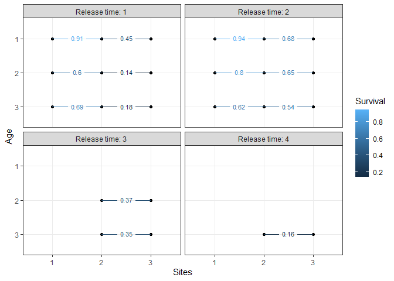

<!-- README.md is generated from README.Rmd. Please edit that file -->

# space4time

<!-- badges: start -->

[](https://github.com/ryanvosbigian/space4time/actions/workflows/R-CMD-check.yaml)
<!-- badges: end -->

The goal of space4time is to provide a user-friendly interface for
fitting a age-specific time-stratified space-for-time mark-recapture
model.

## Installation

You can install the development version of space4time like so:

``` r
remotes::install_github("ryanvosbigian/space4time")
```

## Example

``` r
library(space4time)
## basic example code

set.seed(1)

# simulate data required to make capture history
sim.dat <- sim_simple_s4t_ch(N = 800)

# to make the capture history, need data in a specific format.

# the observations of individuals need to be in a data.frame, with
# the columns "id", "site", "time", and "removed" (no other columns are used)
head(sim.dat$s4t_ch$obs_data$ch_df)
#>   id site time removed
#> 1  1    1    2   FALSE
#> 2  1    2    3   FALSE
#> 3  2    1    1   FALSE
#> 4  2    2    1   FALSE
#> 5  3    1    1   FALSE
#> 6  3    2    2   FALSE

# id is the individual ID. Converted to a character type.
# site is the name of the site the individual was observed at
# time is the time stratum (i.e. year). Can be a Date format or integer.
# removed is a logical (TRUE or FALSE) that indicates where the individual
#         was removed at that site (i.e. capture but not released)

# the data on the age of the individuals 
head(sim.dat$s4t_ch$obs_data$all_aux)
#>   obs_time   FL ageclass
#> 1        2 -2.8       NA
#> 2        1 -1.5        2
#> 3        1  0.9       NA
#> 4        1  4.9        3
#> 5        2 -3.6        1
#> 6        1  4.8        3
# the required columns are "id", "obs_time", and "ageclass"
# id is the individual id. Note that all individuals must be included
# obs_time is the time when the age of the individuals was observed. Or,
#           if the time when the individual was first observed.
# ageclass is the age of the individual. If age is unknown, NA is used.
# Other columns can be used in the ageclass submodel or for 
#           individual based covariates. NAs are not allowed.

# Also need to make the s4t_config object, which describes the sites arrangement,
# and the ages that individuals can be.

# Fitting the model.
# p_formula = ~ t : detection probability varies by time (note that
#                   detection probabilities are not used for transitions from
#                   the first site or to the last site. 
#                   Because there are only 3 sites, the only site where
#                   detection probs are estimated are for site 2. 
#                   If there were additional sites, then we would use ~t*k)

# theta_formula = ~ a1 * a2 * s * j : fitting the fully saturated transition
#                                     probabilities. This allows for separate
#                                     probabilities for each age, duration of
#                                     holdover (i.e. age that individuals
#                                     transition to the next site), time, 
#                                     and site.

# fixed_age = TRUE : The age-class submodel is fit separately, and the outputs
#                     are used in the mark-recapture model. The model runs
#                     faster when this is done.

m1 <- fit_s4t_cjs_rstan(
      p_formula = ~ t,
      theta_formula = ~ a1 * a2 * s * j,
      ageclass_formula = ~ FL,
      fixed_age = TRUE,
      s4t_ch = sim.dat$s4t_ch,
      chains = 2,
      warmup = 200,
      iter = 600
    )
#> 
#> SAMPLING FOR MODEL 's4t_cjs_fixedage_draft7' NOW (CHAIN 1).
#> Chain 1: 
#> Chain 1: Gradient evaluation took 0.0013 seconds
#> Chain 1: 1000 transitions using 10 leapfrog steps per transition would take 13 seconds.
#> Chain 1: Adjust your expectations accordingly!
#> Chain 1: 
#> Chain 1: 
#> Chain 1: Iteration:   1 / 600 [  0%]  (Warmup)
#> Chain 1: Iteration:  60 / 600 [ 10%]  (Warmup)
#> Chain 1: Iteration: 120 / 600 [ 20%]  (Warmup)
#> Chain 1: Iteration: 180 / 600 [ 30%]  (Warmup)
#> Chain 1: Iteration: 201 / 600 [ 33%]  (Sampling)
#> Chain 1: Iteration: 260 / 600 [ 43%]  (Sampling)
#> Chain 1: Iteration: 320 / 600 [ 53%]  (Sampling)
#> Chain 1: Iteration: 380 / 600 [ 63%]  (Sampling)
#> Chain 1: Iteration: 440 / 600 [ 73%]  (Sampling)
#> Chain 1: Iteration: 500 / 600 [ 83%]  (Sampling)
#> Chain 1: Iteration: 560 / 600 [ 93%]  (Sampling)
#> Chain 1: Iteration: 600 / 600 [100%]  (Sampling)
#> Chain 1: 
#> Chain 1:  Elapsed Time: 19.786 seconds (Warm-up)
#> Chain 1:                36.958 seconds (Sampling)
#> Chain 1:                56.744 seconds (Total)
#> Chain 1: 
#> 
#> SAMPLING FOR MODEL 's4t_cjs_fixedage_draft7' NOW (CHAIN 2).
#> Chain 2: 
#> Chain 2: Gradient evaluation took 0.001512 seconds
#> Chain 2: 1000 transitions using 10 leapfrog steps per transition would take 15.12 seconds.
#> Chain 2: Adjust your expectations accordingly!
#> Chain 2: 
#> Chain 2: 
#> Chain 2: Iteration:   1 / 600 [  0%]  (Warmup)
#> Chain 2: Iteration:  60 / 600 [ 10%]  (Warmup)
#> Chain 2: Iteration: 120 / 600 [ 20%]  (Warmup)
#> Chain 2: Iteration: 180 / 600 [ 30%]  (Warmup)
#> Chain 2: Iteration: 201 / 600 [ 33%]  (Sampling)
#> Chain 2: Iteration: 260 / 600 [ 43%]  (Sampling)
#> Chain 2: Iteration: 320 / 600 [ 53%]  (Sampling)
#> Chain 2: Iteration: 380 / 600 [ 63%]  (Sampling)
#> Chain 2: Iteration: 440 / 600 [ 73%]  (Sampling)
#> Chain 2: Iteration: 500 / 600 [ 83%]  (Sampling)
#> Chain 2: Iteration: 560 / 600 [ 93%]  (Sampling)
#> Chain 2: Iteration: 600 / 600 [100%]  (Sampling)
#> Chain 2: 
#> Chain 2:  Elapsed Time: 22.833 seconds (Warm-up)
#> Chain 2:                36.527 seconds (Sampling)
#> Chain 2:                59.36 seconds (Total)
#> Chain 2:


# plot the transition probabilities:
plotTransitions(m1)
```



``` r

# plot the apparent survival probabilities:
plotSurvival(m1)
```


