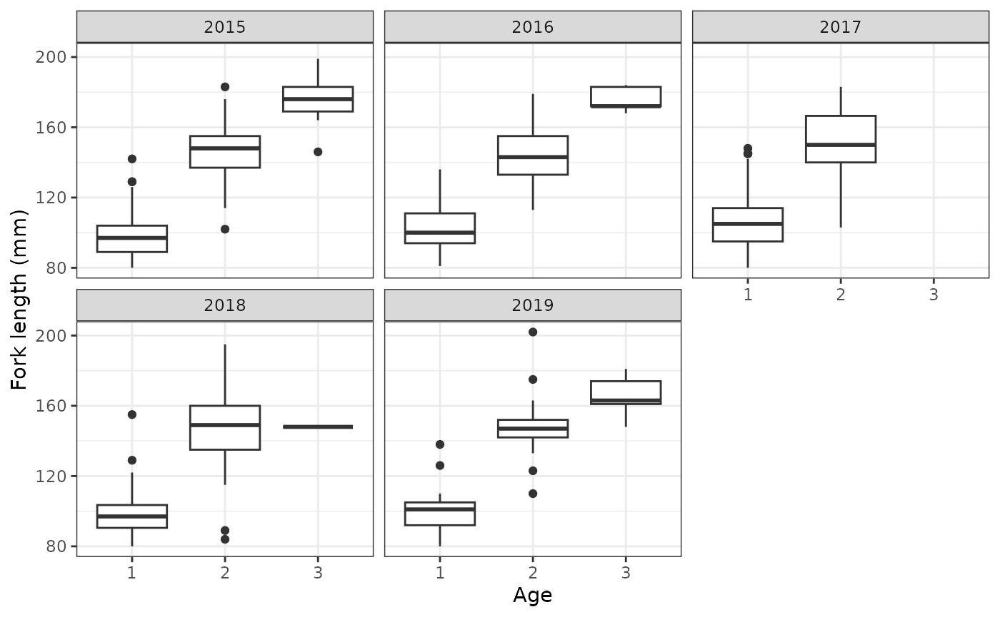
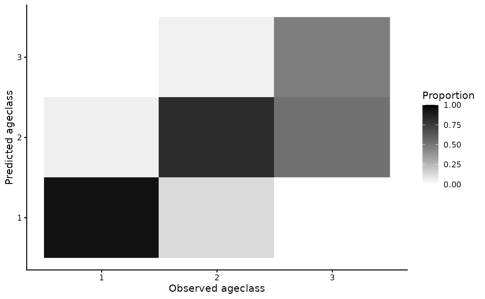
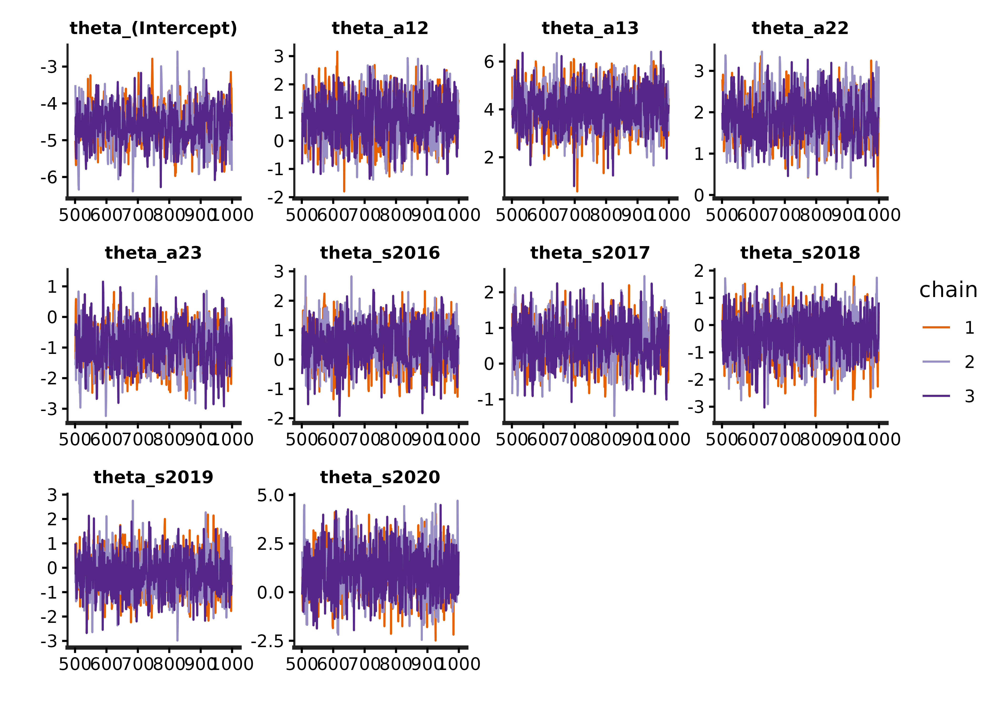
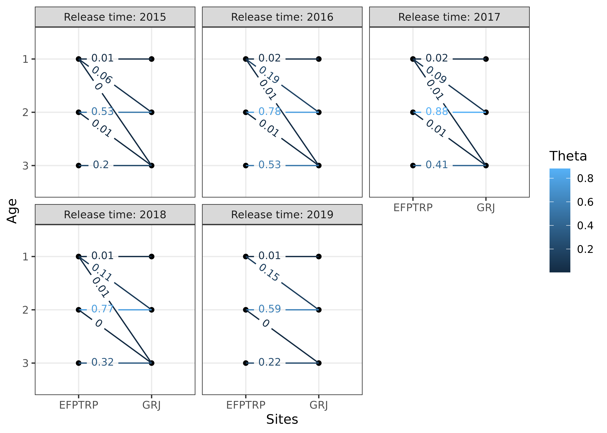
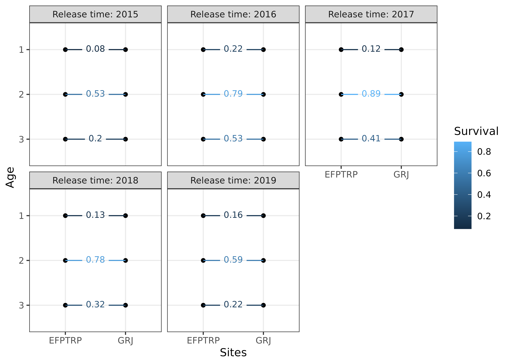
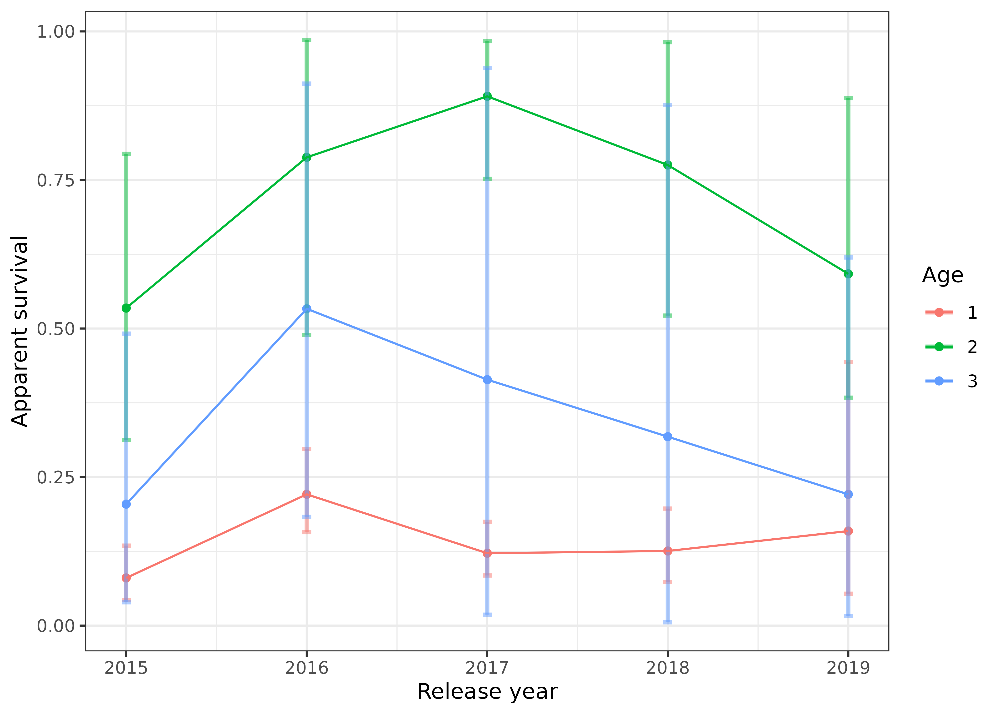
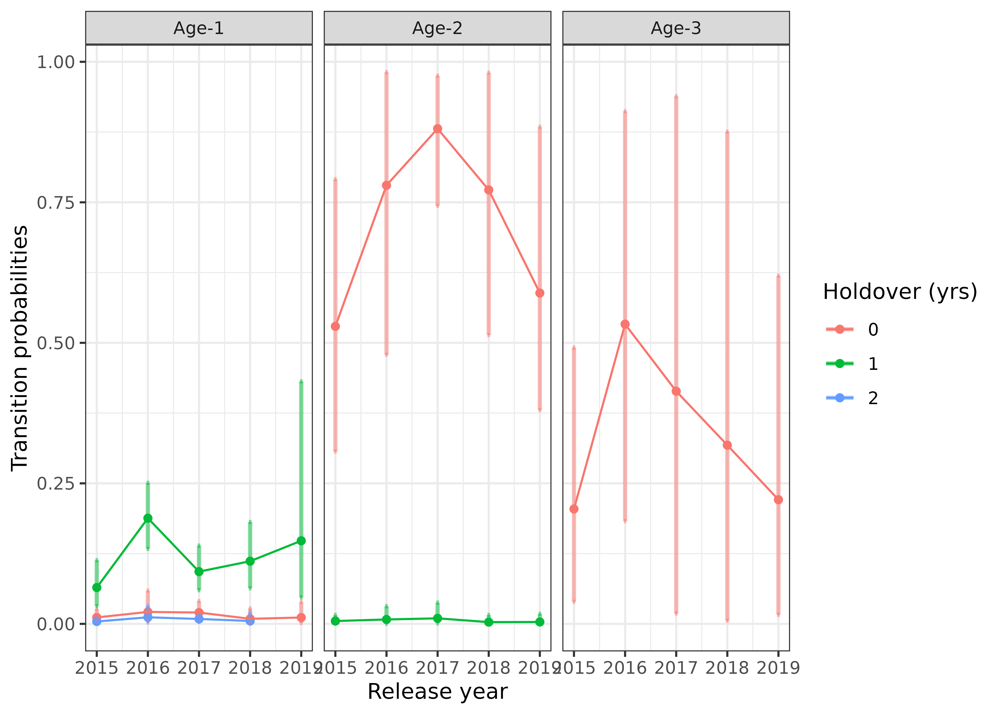

# Example using PTAGIS queries

``` r
library(space4time)
library(dplyr)
#> 
#> Attaching package: 'dplyr'
#> The following objects are masked from 'package:stats':
#> 
#>     filter, lag
#> The following objects are masked from 'package:base':
#> 
#>     intersect, setdiff, setequal, union
library(ggplot2)
```

This is an example workflow for implementing the model. This
implementation uses data queried from Columbia Basin Research Data
Access in Real Time (DART). The Columbia Basin Research has a query that
was developed for use with the Basin TribPit software. However, the data
can also be used by *space4time*.

## Data processing

We start with the observations of individuals from the East Fork
Potlatch River Rotary Screw Trap, which has the site name: EFPTRP
(previously POTREF). We’ll use observations from 2015 to 2019 for this
example. These data are from Idaho Department of Fish and Game’s
juvenile trapping database.

Here are some of the rows of a file that contain data on juvenile
steelhead encountered at this rotary screw trap. Some of the columns
(`id`, `obs_time`, and `ageclass`) are required to have those names. Any
additional variables can be included. However, complete data for all
variables (except `ageclass`) is required for any of the following
analyses.

``` r
EFPTRP_age_data[10:15,]%>%
  knitr::kable(row.names = FALSE)
```

| id             | obs_time | SurveyDate |  FL | Bin | Season | ageclass |
|:---------------|---------:|:-----------|----:|----:|:-------|---------:|
| 3DD.007753945C |     2015 | 5/3/2015   |  80 |  80 | Spring |       NA |
| 3DD.007753732D |     2015 | 5/4/2015   |  80 |  80 | Spring |        1 |
| 3DD.0077535753 |     2015 | 5/5/2015   |  80 |  80 | Spring |       NA |
| 3DD.0077532003 |     2015 | 5/8/2015   |  80 |  80 | Spring |       NA |
| 3DD.0077537A2A |     2015 | 5/9/2015   |  80 |  80 | Spring |       NA |
| 3DD.007752C3C2 |     2015 | 5/11/2015  |  80 |  80 | Spring |       NA |

We identify and drop duplicate observations as well as drop individuals
with missing auxilary data (`FL`).

``` r

# identify individuals with more than one observation at the RST in the data
EFPTRP_age_data %>%
  dplyr::group_by(id) %>% # groups data by ID
  dplyr::arrange(id,SurveyDate) %>% # sorts by ID and date
  dplyr::mutate(Obs = dplyr::n()) %>% # creates a column that is the number of times
                                      # each individual is in the data
  filter(Obs > 1) # filter for multiple observations
#> # A tibble: 0 × 8
#> # Groups:   id [0]
#> # ℹ 8 variables: id <chr>, obs_time <int>, SurveyDate <chr>, FL <int>,
#> #   Bin <int>, Season <chr>, ageclass <int>, Obs <int>

# identify missing data
EFPTRP_age_data %>%
  dplyr::filter(is.na(FL)) # filter for FL as NA
#> [1] id         obs_time   SurveyDate FL         Bin        Season     ageclass  
#> <0 rows> (or 0-length row.names)

# drop duplicate observations (keep the first observation) and missing data
EFPTRP_age_data <- EFPTRP_age_data %>%
  dplyr::group_by(id) %>%
  dplyr::arrange(id,SurveyDate) %>%
  dplyr::summarize(         # summarizes by id, so it returns 1 row per id
            id = dplyr::first(id), # retains the first value
            SurveyDate = dplyr::first(SurveyDate),
            obs_time = dplyr::first(obs_time), 
            FL = dplyr::first(FL),
            Bin = dplyr::first(Bin),
            Season = dplyr::first(Season),
            ageclass = dplyr::first(ageclass)
            # obs_site = first(obs_site), # save the first observation of any additional variables
            ) %>%
  dplyr::filter(!is.na(FL)) 
```

Instead of using fork lengths, for this example we will use binned fork
lengths. This allows for greater efficency in model fitting because it
allows for observations to be marginalized (grouped together). The bins
are also z-scored (centered and divided by the standard deviation) to
help with model fitting if Bin is treated as a continuous variable. The
min and max bin are truncated so that there are not any bins with only a
handful of observations.

``` r
# create histogram to visualize the distribution of fork lengths
# hist(EFPTRP_age_data$FL,breaks = 50)


EFPTRP_age_data <- EFPTRP_age_data %>%
  dplyr::mutate(Bin = dplyr::case_when(FL < 80 ~ 80, # if FL < 80, return 80
                                       FL >180 ~ 180, # if FL greater than 180, return 180
                                       # otherwise, round FL to the nearest 10 mm.
                                       FL >= 80 & FL <= 180 ~ round(FL,-1)), 
                Bin_sc = (Bin - mean(Bin)) / stats::sd(Bin)) # z-scale Bin
```

To obtain capture history data, we used query tools developed by DART
for Basin TribPit using functions available in the `space4time` package.
We used tools developed for Basin TribPit and PitPro to query PTAGIS and
identify transported fish. More information regarding Basin TribPit and
the associated queries can be found at
“<https://www.cbr.washington.edu/analysis/apps/BasinTribPit>”. To
conduct queries, we used the query “Upload TagID List created by the
user” (“<https://www.cbr.washington.edu/dart/query/pit_tagids>”). We
uploaded the tag list of observations from the age data and conducted
the query to create a “TribPit Observation File”
(“pitbasin_branching_upload_1759171262_907.csv”). To identify
transported fish, we use their “site_config.txt” file, which located on
the page for PitPro
(“<https://www.cbr.washington.edu/analysis/apps/pitpro>”) and is
regularly updated
(“<https://www.cbr.washington.edu/paramest/docs/pitpro/updates/sites_config.txt>”).

An alternative to using the queries in DART is to use a Complete Tag
History query in PTAGIS. However, care must be taken to identify
indiviudals that were transported by barges.

The function to process DART TribPit observation files is
[`read_DART_file()`](https://ryanvosbigian.github.io/space4time/reference/read_DART_file.md).
The first argument is the filepath to the “TribPit Observation File”,
the second is the age data, that need to the specific columns identified
above, and third (optional) is the path to the “site_config.txt” file.
The default is to use the link.

``` r
proc_DART_data <- read_DART_file(filepath = "pitbasin_branching_upload_1759171262_907.csv",
               aux_age_df = EFPTRP_age_data,
               DART_config = "sites_config.txt")
#> Obtained the PTAGIS site configuration formatted by DART from:
#> sites_config.txt
#> Warning in identify_barged_fish(capture_data, parsed_df): Number of
#> observations without info. Assuming not transported. N = 1
```

Note see
[`?read_DART_file`](https://ryanvosbigian.github.io/space4time/reference/read_DART_file.md)
if there were more than one DART file to include.

The output from `read_DART_file` (`proc_DART_data`) is a list with two
objects, a data.frame of capture occasions (`proc_DART_data$ch_df`) and
a data frame of the age auxiliary data (`proc_DART_data$aux_age_df`)

``` r
ch_df <- proc_DART_data$ch_df
head(ch_df)
#>               id   site time removed
#> 1 384.3B23958521    BCC 2015   FALSE
#> 2 384.3B23958521 POTREF 2015   FALSE
#> 3 384.3B23958521    TWX 2015   FALSE
#> 4 384.3B2397A68E    GOJ 2015   FALSE
#> 5 384.3B2397A68E    GRJ 2015   FALSE
#> 6 384.3B2397A68E POTREF 2015   FALSE

aux_age_df <- proc_DART_data$aux_age_df

head(aux_age_df)
#> # A tibble: 6 × 8
#>   id             SurveyDate obs_time    FL   Bin Season ageclass Bin_sc
#>   <chr>          <chr>         <int> <int> <dbl> <chr>     <int>  <dbl>
#> 1 384.3B23958521 3/15/2015      2015   205   180 Spring       NA   2.47
#> 2 384.3B2397A68E 3/19/2015      2015   160   160 Spring       NA   1.74
#> 3 384.3B239C9845 3/20/2015      2015   177   180 Spring       NA   2.47
#> 4 384.3B239D8C19 3/19/2015      2015   160   160 Spring       NA   1.74
#> 5 384.3B239EB35C 3/19/2015      2015   137   140 Spring        2   1.01
#> 6 384.3B239ED4C7 3/19/2015      2015   138   140 Spring       NA   1.01
```

Summarize some of the observations

``` r
table(aux_age_df$ageclass)
#> 
#>   1   2   3 
#> 388 192  21
```

``` r
table(ch_df$site)
#> 
#>    B2J    BBA    BCC    BO1    BO2    BO3    BO4    DRM EFPTRP    EPR    GOA 
#>      3      1     38      2      2      3      5      1    685      1      5 
#>    GOJ    GRA    GRJ    GRS    HLM    ICH    JDJ    JO1    JO2    KHS    LAP 
#>    126      5    191      8    259     21     39      2      1      5      1 
#>    LMA    LMJ    MC1    MCJ    PCM POTREF    TD1    TD2    TWX 
#>      5     84      5     19      2   2451      4      2     14
```

In this case, some of the observations are likely of kelts, which are
post-spawning adult steelhead attempting to return to the ocean. To
exclude these, we can use the
[`remove_kelt_obs()`](https://ryanvosbigian.github.io/space4time/reference/remove_kelt_obs.md)
function.

The `kelt_obssite` argument is the site after which all observations
should be dropped, meaning that if an individual is observed at this
site, then all further observations of the individual in the same or
next time periods should be dropped. The Lower Granite Dam fish ladder
site (“GRA”) is used to identify adults.

``` r
ch_df2 <- remove_kelt_obs(ch_df = ch_df,kelt_obssite = "GRA")
#> Dropping observations after observations at the following sites: GRA
```

Next, we can drop observations at non-target sites.

``` r
# only keep observations in the following sites
ch_df3 <- ch_df2 %>% 
  dplyr::filter(site %in% c("EFPTRP","POTREF","GOJ","GRJ","LMJ","MCJ","TWX","JDJ","BCC","B2J")) 
```

Note that here, the name of the RST in the EF Potlatch River was POTREF
at some points in time.

Next, we can check what age range to include for each site:

``` r
# returns a data frame of the ages of known age fish at different observations
ch_df %>%
  dplyr::left_join(aux_age_df,by = "id") %>%  # merge age data with capture history
  dplyr::filter(!is.na(ageclass)) %>% # only check observations of known age fish
  dplyr::mutate(Age_at_obs = ageclass + (time - obs_time)) %>% # calculate known age
  dplyr::group_by(site,Age_at_obs) %>% # group by site and age at site
  dplyr::summarise(N = dplyr::n()) # summarize number of observations
#> # A tibble: 32 × 3
#> # Groups:   site [19]
#>    site   Age_at_obs     N
#>    <chr>       <dbl> <int>
#>  1 BCC             2     2
#>  2 BO2             3     1
#>  3 BO4             3     1
#>  4 EFPTRP          1    76
#>  5 EFPTRP          2    59
#>  6 EFPTRP          3     7
#>  7 GOA             3     1
#>  8 GOJ             1     3
#>  9 GOJ             2    25
#> 10 GOJ             3     3
#> # ℹ 22 more rows
```

The range of ages at each site is 1 through 3. All sites with
substantial observations have the same range.

This ends the initial data cleaning. Now, we can create site
configuration object. Because there are multiple names for the initial
release site, these are treated as if there are multiple release sites
so we use the `simplebranch_s4t_config` function. The sites are
reprinted below.

``` r
table(ch_df3$site)
#> 
#>    B2J    BCC EFPTRP    GOJ    GRJ    JDJ    LMJ    MCJ POTREF    TWX 
#>      3     38    685    126    191     39     84     19   2451     14
```

## Creating the capture history object

See documentation for more details
([`?simplebranch_s4t_config`](https://ryanvosbigian.github.io/space4time/reference/simplebranch_s4t_config.md)).
The East Fork Potlatch RST has been at multiple locations, although here
we treat them as the same site because they are not at substantially
different locations. The sites_to_pool argument is used to merge these
sites together. The holdover sites are the sites after which individuals
can holdover before transitioning to the next site. The `branch_sites`
argument specifies the initial branching sites, which are the two names
for the East Fork Potlatch RST.

Here, we assume that no fish holdover after passing Lower Granite Dam
(“GRJ”). We pool all recapture sites below Little Goose Dam (“GOJ”) with
Little Goose. We have to specify min age and max age for each site even
if they are pooled.

``` r
ef_pot_site_config <- simplebranch_s4t_config(sites_names = c("EFPTRP",
                                                        "POTREF",
                                                        "GRJ","GOJ","LMJ","MCJ","JDJ",
                                                        "BCC",
                                                        "TWX"),
                                              branch_sites = c("EFPTRP",
                                                          "POTREF"),
                                       holdover_sites = c("EFPTRP",
                                                          "POTREF"),
                                       sites_to_pool = list("EFPTRP" = c("EFPTRP","POTREF"),
                                                            "GOJ" = c("LMJ","MCJ","JDJ",
                                                                      "BCC","TWX")),
                                       min_a = c("EFPTRP" = 1,
                                                 "POTREF" = 1,
                                                 "GRJ" = 1,
                                                 "GOJ" = 1,
                                                 "LMJ" = 1,
                                                 "MCJ" = 1,
                                                 "JDJ" = 1,
                                                 "BCC" = 1,
                                                 "TWX" = 1),
                                       max_a = c("EFPTRP" = 3,
                                                 "POTREF" = 3,
                                                 "GRJ" = 3,
                                                 "GOJ" = 3,
                                                 "LMJ" = 3,
                                                 "MCJ" = 3,
                                                 "JDJ" = 3,
                                                 "BCC" = 3,
                                                 "TWX" = 3)

)

print(ef_pot_site_config)
#> Site and age transition configuration object
#> 
#> There are N = 3 with N = 1 sites with holdovers
#> 
#> Sites: EFPTRP, GRJ, GOJ
#> 
#> Sites with holdovers: EFPTRP
#> 
#> Sites pooled:
#> EFPTRP include: POTREF
#> GOJ include: LMJ, MCJ, JDJ, BCC, TWX
#> 
#> Site -> site:
#> EFPTRP -> GRJ
#> GRJ -> GOJ
#> GOJ -> 
#> 
#> Age range per site:
#> EFPTRP: 1-3
#> GRJ: 1-3
#> GOJ: 1-3
```

Next, we create initial capture history object:

``` r
efp_s4_ch <- s4t_ch(ch_df = ch_df3,aux_age_df = aux_age_df,s4t_config = ef_pot_site_config)
#> Removing sites from capture history: B2J
#> Note, there are IDs in aux_age_df that are not in ch_df, n = 1
#> 
#> Error log:
#> 
#> Repeat encounters at same site N = 0
#> Individuals observed after being removed ('zombies') N = 3
#> Gap in observation times that exceed max difference in ages N = 3
#> Holdovers observed between sites with only direct transitions N = 0
#> Reverse movements N = 1
#> Known age individuals with ages outside of site-specific age-range N = 0
#> Individuals with missing initial release site N = 0
#> 
#> Potential errors:
#> Site/time combinations with 0 observations N = 0
#> Site/time combinations with less than 10 observations N = 2
#> Maximum release occasions in l_matrix and m_matrix do not match.
```

We need to address the errors in the error log. We can use the
[`clean_s4t_ch_obs()`](https://ryanvosbigian.github.io/space4time/reference/clean_s4t_ch_obs.md)
function, which returns a cleaned capture history data frame as well as
information on what observations were dropped.

``` r
clean_ch_df <- clean_s4t_ch_obs(efp_s4_ch)
#> N = 4 observations and N = 0 individuals were dropped.
```

We can inspect what observations were dropped and determine whether
these makes biological sense.

``` r

# show dropped observations
clean_ch_df$dropped_ch_df

# show full observation history of individuals with dropped observations
clean_ch_df$intermediate_ch_df %>%
  dplyr::group_by(id) %>% # group by ID
  dplyr::filter(any(drop_obs == TRUE)) %>% # keep only individuals with dropped observations
  head() # print out only the first 6 observations


# can inspect individuals

# aux_age_df %>%
#   dplyr::filter(id == "3DD.00778C962F")

# clean_ch_df$intermediate_ch_df %>%
#   dplyr::filter(id == "3DD.00778C962F")
```

Next, we re-make the capture history object using the cleaned `ch_df`
data frame.

``` r
efp_s4_ch2 <- s4t_ch(ch_df = clean_ch_df$cleaned_ch_df,aux_age_df = aux_age_df,s4t_config = ef_pot_site_config)
#> Note, there are IDs in aux_age_df that are not in ch_df, n = 1
#> 
#> Error log:
#> 
#> Repeat encounters at same site N = 0
#> Individuals observed after being removed ('zombies') N = 0
#> Gap in observation times that exceed max difference in ages N = 0
#> Holdovers observed between sites with only direct transitions N = 0
#> Reverse movements N = 0
#> Known age individuals with ages outside of site-specific age-range N = 0
#> Individuals with missing initial release site N = 0
#> 
#> Potential errors:
#> Site/time combinations with 0 observations N = 0
#> Site/time combinations with less than 10 observations N = 1
```

There are no errors, so we can use this capture history object in our
analyses. If there were more errors (which does occasionally happen), we
could clean the `efp_s4_ch2` object and see if the errors can be
corrected by the cleaning function. As observations are removed more
issues can arise, so cleaning, remaking the capture history object,
cleaning the remade object, and remaking it again can happen.

Next, we can fit the model for age class. First, we will compute some
summaries of the ageing data.

``` r
# annual summaries
aux_age_df %>%
  dplyr::filter(!is.na(ageclass)) %>% # only include observations with ages
  dplyr::group_by(obs_time,ageclass) %>% # group by age and obs_time (year)
  dplyr::summarize(mean_FL = mean(FL), # mean FL
            sd_FL = stats::sd(FL),   # sd of FL
            N = dplyr::n())          # number of observations
#> `summarise()` has grouped output by 'obs_time'. You can override using the
#> `.groups` argument.
#> # A tibble: 14 × 5
#> # Groups:   obs_time [5]
#>    obs_time ageclass mean_FL sd_FL     N
#>       <int>    <int>   <dbl> <dbl> <int>
#>  1     2015        1    98.0 12.4     91
#>  2     2015        2   146.  16.4     53
#>  3     2015        3   176.  15.9      9
#>  4     2016        1   103.  12.2     57
#>  5     2016        2   144.  16.2     41
#>  6     2016        3   176.   7.22     5
#>  7     2017        1   106.  15.2    164
#>  8     2017        2   150.  19.2     39
#>  9     2018        1    99.2 12.4     51
#> 10     2018        2   146.  23.2     31
#> 11     2018        3   148   NA        1
#> 12     2019        1    99.8 12.6     25
#> 13     2019        2   148.  16.0     28
#> 14     2019        3   166.  12.0      6


# create boxplot of fork length by ages
aux_age_df %>% 
  dplyr::filter(!is.na(ageclass)) %>% # only include observations with ages
  ggplot2::ggplot(ggplot2::aes(factor(ageclass), FL)) +
  geom_boxplot() +
  facet_wrap(~obs_time) +
  theme_bw() +
  labs(x = "Age",y = "Fork length (mm)")
```



## Fit models

Based on the above figure, we have the following models for ageclass,
which use ordinal regression. We could use FL or scaled FL, but we will
instead use the binned fork length and the scaled binned fork length.
This is so that the model can be more efficient as a result of
marginalization. Use one-sided formulas.

``` r

age_mod1 <- fit_ageclass(age_formula = ~ I(factor(obs_time)) + Bin_sc,
                         s4t_ch = efp_s4_ch2)

age_mod2 <- fit_ageclass(age_formula = ~ I(factor(obs_time)) * Bin_sc,
                         s4t_ch = efp_s4_ch2)

age_mod3 <- fit_ageclass(age_formula = ~ I(factor(obs_time)) + I(factor(Bin)),
                         s4t_ch = efp_s4_ch2)
```

We can inspect some simple goodness of fit:

``` r
plot(age_mod1)
```



If further goodness-of-fit metrics are desired, there is a `predict`
function for the ageclass models that can be used to return predicted
values (see
[`?predict.s4t_ageclass_model`](https://ryanvosbigian.github.io/space4time/reference/predict.s4t_ageclass_model.md)).

We can use AIC to select the best fitting model:

``` r
AIC(age_mod1,age_mod2,age_mod3)
#>          df      AIC
#> age_mod1  7 177.8796
#> age_mod2 11 181.8134
#> age_mod3 16 190.2178
```

The first model is selected based on AIC.

Next, we fit space-for-time mark recapture models. The ageclass model is
the top model from above (note: use one-sided formulas only). The
formulas for detection probability (`p`) and conditional transition
probability (`theta`) are determined based on the site structure. There
is only one site, so the full model for theta is
`theta ~ a1 * a2 * s * j`, which allows for different transitions based
on time at “release” (`s`), “release” site (`j`), age at “release”
(`a1`), and age at “recapture” (`a2`). The quotes around “release” and
“recapture” indicate that the captures can be passive and that in this
case does not imply actual capture (i.e. if they passed a site but
weren’t detected). We recommend fitting the full model for theta to
obtain transition estimates for every combination of age, time, and
site. Many reduced formulas would not make sense.

The full model for p is `p ~ t * a1 * a2`, which allows for different
detection probability for each time of “recapture” (`t`), age at
“release” (`a1`), and age at “recapture” (`a2`). Site is technically
included, but because detection probabilities are not estimated for the
first or final site, only the second site (“GRJ”) has detection
probabilities estimated. The detection probabilities for the final site
are not separable from transition rates (note: this means that
transition rates estimated between “GRJ” and “GOJ” are not actually the
transition rates).

The full model for p may be over-parameterized, so we also fit reduced
formulas where detection probability only depends on time and where
detection probability depends on time and age at “recapture”.

``` r
# Allows for parallel computation (reduces overall time)
rstan::rstan_options(auto_write = TRUE)
options(mc.cores = parallel::detectCores())

s4t_m1 <- fit_s4t_cjs_rstan(p_formula = ~ t,
                            theta_formula = ~ a1 * a2 * s * j,
                            ageclass_formula = ~ I(factor(obs_time)) + Bin_sc,
                            fixed_age = FALSE,
                            s4t_ch = efp_s4_ch2)


s4t_m2 <- fit_s4t_cjs_rstan(p_formula = ~ t * a2,
                            theta_formula = ~ a1 * a2 * s * j,
                            ageclass_formula = ~ I(factor(obs_time)) + Bin_sc,
                            fixed_age = FALSE,
                            s4t_ch = efp_s4_ch2)

# full model
s4t_m3 <- fit_s4t_cjs_rstan(p_formula = ~ t * a1 * a2,
                            theta_formula = ~ a1 * a2 * s * j,
                            ageclass_formula = ~ I(factor(obs_time)) + Bin_sc,
                            fixed_age = FALSE,
                            s4t_ch = efp_s4_ch2)

# optionally save model objects
# save(s4t_m1,s4t_m2,s4t_m3, file = "EF_Potlatch_s4t.RData")
```

## Check and evaluate fitted models

We can check model fits:

``` r
s4t_m1
#> Inference for Stan model: s4t_cjs_draft7.
#> 3 chains, each with iter=1000; warmup=500; thin=1; 
#> post-warmup draws per chain=500, total post-warmup draws=1500.
#> 
#>                                  mean se_mean   sd  2.5%   25%   50%   75%
#> theta_(Intercept)               -4.58    0.02 0.50 -5.60 -4.91 -4.56 -4.26
#> theta_a12                        0.79    0.02 0.77 -0.76  0.29  0.83  1.33
#> theta_a13                        4.04    0.02 0.84  2.39  3.46  4.07  4.60
#> theta_a22                        1.87    0.02 0.52  0.86  1.52  1.87  2.19
#> theta_a23                       -0.98    0.02 0.65 -2.26 -1.42 -0.98 -0.55
#> theta_s2016                      0.52    0.02 0.70 -0.92  0.05  0.55  1.02
#> theta_s2017                      0.61    0.02 0.58 -0.53  0.23  0.61  0.98
#> theta_s2018                     -0.42    0.02 0.79 -2.01 -0.95 -0.39  0.15
#> theta_s2019                     -0.23    0.02 0.80 -1.75 -0.77 -0.23  0.30
#> theta_s2020                      1.04    0.03 1.20 -1.27  0.22  1.00  1.79
#> theta_jGRJ                       0.45    0.03 0.84 -1.13 -0.16  0.46  0.99
#> theta_a12:a22                    2.05    0.02 0.75  0.61  1.55  2.04  2.56
#> theta_a12:s2016                  0.05    0.03 1.10 -2.05 -0.70  0.03  0.79
#> theta_a13:s2016                  0.57    0.03 1.00 -1.32 -0.12  0.52  1.23
#> theta_a12:s2017                  1.26    0.03 1.06 -0.85  0.52  1.28  2.00
#> theta_a13:s2017                  0.12    0.02 1.43 -2.87 -0.81  0.11  1.09
#> theta_a12:s2018                  0.06    0.03 1.18 -2.16 -0.76  0.06  0.84
#> theta_a13:s2018                  0.34    0.03 1.37 -2.36 -0.63  0.37  1.32
#> theta_a12:s2019                 -0.54    0.02 0.87 -2.33 -1.07 -0.52  0.01
#> theta_a13:s2019                  0.27    0.02 1.21 -2.02 -0.59  0.29  1.12
#> theta_a12:s2020                  0.87    0.03 1.26 -1.46 -0.01  0.84  1.72
#> theta_a22:s2016                  0.74    0.03 0.74 -0.60  0.22  0.72  1.24
#> theta_a23:s2016                  0.61    0.03 0.92 -1.16 -0.01  0.60  1.24
#> theta_a22:s2017                 -0.17    0.02 0.62 -1.36 -0.58 -0.19  0.24
#> theta_a23:s2017                  0.25    0.03 0.77 -1.26 -0.28  0.26  0.79
#> theta_a22:s2018                  1.03    0.02 0.84 -0.54  0.48  0.98  1.57
#> theta_a23:s2018                  0.33    0.03 1.07 -1.81 -0.42  0.37  1.07
#> theta_a22:s2019                  1.04    0.02 0.89 -0.67  0.42  1.03  1.64
#> theta_a23:s2019                 -0.08    0.02 1.12 -2.49 -0.80 -0.06  0.64
#> theta_a12:jGRJ                  -2.00    0.03 0.94 -3.86 -2.62 -2.00 -1.39
#> theta_a13:jGRJ                   0.44    0.03 1.20 -1.90 -0.37  0.44  1.25
#> theta_s2016:jGRJ                -0.86    0.03 1.12 -3.10 -1.59 -0.83 -0.13
#> theta_s2017:jGRJ                 1.15    0.03 0.95 -0.76  0.50  1.16  1.80
#> theta_s2018:jGRJ                -0.24    0.03 1.06 -2.33 -0.97 -0.25  0.47
#> theta_s2019:jGRJ                 0.87    0.03 1.08 -1.28  0.22  0.92  1.61
#> theta_a12:a22:s2016              0.10    0.03 1.12 -2.03 -0.66  0.08  0.84
#> theta_a12:a22:s2017              0.34    0.03 1.03 -1.62 -0.39  0.34  1.04
#> theta_a12:a22:s2018              0.66    0.03 1.07 -1.43 -0.07  0.62  1.36
#> theta_a12:s2016:jGRJ            -0.67    0.03 1.16 -3.01 -1.50 -0.64  0.15
#> theta_a13:s2016:jGRJ             0.17    0.03 1.29 -2.29 -0.70  0.14  1.02
#> theta_a12:s2017:jGRJ            -1.74    0.03 1.03 -3.74 -2.43 -1.75 -1.08
#> theta_a13:s2017:jGRJ            -0.05    0.03 1.43 -2.80 -1.02 -0.02  0.88
#> theta_a12:s2018:jGRJ             0.01    0.03 1.15 -2.27 -0.76  0.07  0.80
#> theta_a13:s2018:jGRJ            -0.15    0.03 1.33 -2.78 -1.05 -0.20  0.74
#> theta_a12:s2019:jGRJ             0.06    0.03 1.15 -2.12 -0.70  0.04  0.82
#> theta_a13:s2019:jGRJ             0.98    0.03 1.23 -1.29  0.13  0.94  1.82
#> p_(Intercept)                   -1.87    0.02 0.36 -2.55 -2.12 -1.87 -1.63
#> p_t2016                          0.03    0.02 0.43 -0.82 -0.24  0.03  0.32
#> p_t2017                          0.90    0.02 0.39  0.12  0.64  0.91  1.17
#> p_t2018                          0.86    0.02 0.43  0.02  0.57  0.87  1.14
#> p_t2019                          1.17    0.02 0.46  0.29  0.87  1.18  1.47
#> p_t2020                         -4.00    0.07 2.39 -9.41 -5.36 -3.61 -2.29
#> overall_surv[1]                  0.08    0.00 0.02  0.04  0.06  0.08  0.09
#> overall_surv[2]                  0.53    0.00 0.13  0.31  0.45  0.52  0.61
#> overall_surv[3]                  0.20    0.00 0.12  0.04  0.12  0.18  0.27
#> overall_surv[4]                  0.22    0.00 0.04  0.16  0.20  0.22  0.24
#> overall_surv[5]                  0.79    0.00 0.14  0.49  0.69  0.81  0.90
#> overall_surv[6]                  0.53    0.00 0.20  0.18  0.38  0.53  0.67
#> overall_surv[7]                  0.12    0.00 0.02  0.08  0.11  0.12  0.13
#> overall_surv[8]                  0.89    0.00 0.06  0.75  0.85  0.90  0.94
#> overall_surv[9]                  0.41    0.01 0.28  0.02  0.16  0.38  0.64
#> overall_surv[10]                 0.13    0.00 0.03  0.07  0.10  0.12  0.14
#> overall_surv[11]                 0.78    0.00 0.13  0.52  0.68  0.78  0.89
#> overall_surv[12]                 0.32    0.01 0.27  0.01  0.07  0.24  0.53
#> overall_surv[13]                 0.16    0.00 0.10  0.05  0.10  0.13  0.19
#> overall_surv[14]                 0.59    0.00 0.13  0.38  0.50  0.58  0.67
#> overall_surv[15]                 0.22    0.00 0.16  0.02  0.10  0.19  0.31
#> overall_surv[16]                 0.02    0.00 0.02  0.00  0.01  0.02  0.03
#> overall_surv[17]                 0.20    0.00 0.06  0.11  0.16  0.19  0.23
#> overall_surv[18]                 0.37    0.00 0.17  0.09  0.22  0.35  0.48
#> overall_surv[19]                 0.02    0.00 0.04  0.00  0.00  0.01  0.03
#> overall_surv[20]                 0.18    0.00 0.05  0.11  0.15  0.17  0.21
#> overall_surv[21]                 0.56    0.01 0.23  0.16  0.38  0.56  0.73
#> overall_surv[22]                 0.10    0.00 0.06  0.02  0.06  0.09  0.13
#> overall_surv[23]                 0.50    0.00 0.06  0.40  0.46  0.50  0.54
#> overall_surv[24]                 0.68    0.01 0.31  0.03  0.45  0.80  0.96
#> overall_surv[25]                 0.02    0.00 0.03  0.00  0.00  0.01  0.02
#> overall_surv[26]                 0.43    0.00 0.10  0.27  0.35  0.41  0.49
#> overall_surv[27]                 0.37    0.01 0.26  0.02  0.14  0.32  0.56
#> overall_surv[28]                 0.06    0.00 0.08  0.00  0.01  0.03  0.08
#> overall_surv[29]                 0.45    0.00 0.11  0.26  0.37  0.45  0.53
#> overall_surv[30]                 0.71    0.00 0.19  0.30  0.58  0.74  0.87
#> overall_surv[31]                 0.58    0.01 0.24  0.14  0.38  0.57  0.79
#> overall_surv[32]                 0.57    0.01 0.26  0.10  0.36  0.58  0.80
#> cohort_surv[1]                   0.01    0.00 0.01  0.00  0.01  0.01  0.01
#> cohort_surv[2]                   0.06    0.00 0.02  0.03  0.05  0.06  0.08
#> cohort_surv[3]                   0.00    0.00 0.00  0.00  0.00  0.00  0.01
#> cohort_surv[4]                   0.53    0.00 0.13  0.31  0.44  0.52  0.61
#> cohort_surv[5]                   0.01    0.00 0.00  0.00  0.00  0.00  0.01
#> cohort_surv[6]                   0.20    0.00 0.12  0.04  0.12  0.18  0.27
#> cohort_surv[7]                   0.02    0.00 0.01  0.00  0.01  0.02  0.03
#> cohort_surv[8]                   0.19    0.00 0.03  0.13  0.17  0.19  0.21
#> cohort_surv[9]                   0.01    0.00 0.01  0.00  0.01  0.01  0.02
#> cohort_surv[10]                  0.78    0.00 0.14  0.48  0.68  0.80  0.90
#> cohort_surv[11]                  0.01    0.00 0.01  0.00  0.00  0.00  0.01
#> cohort_surv[12]                  0.53    0.00 0.20  0.18  0.38  0.53  0.67
#> cohort_surv[13]                  0.02    0.00 0.01  0.01  0.01  0.02  0.02
#> cohort_surv[14]                  0.09    0.00 0.02  0.06  0.08  0.09  0.10
#> cohort_surv[15]                  0.01    0.00 0.00  0.00  0.01  0.01  0.01
#> cohort_surv[16]                  0.88    0.00 0.06  0.74  0.84  0.89  0.93
#> cohort_surv[17]                  0.01    0.00 0.01  0.00  0.00  0.01  0.01
#> cohort_surv[18]                  0.41    0.01 0.28  0.02  0.16  0.38  0.64
#> cohort_surv[19]                  0.01    0.00 0.01  0.00  0.00  0.01  0.01
#> cohort_surv[20]                  0.11    0.00 0.03  0.06  0.09  0.11  0.13
#> cohort_surv[21]                  0.01    0.00 0.01  0.00  0.00  0.00  0.01
#> cohort_surv[22]                  0.77    0.00 0.13  0.51  0.67  0.77  0.88
#> cohort_surv[23]                  0.00    0.00 0.00  0.00  0.00  0.00  0.00
#> cohort_surv[24]                  0.32    0.01 0.27  0.01  0.07  0.24  0.53
#> cohort_surv[25]                  0.01    0.00 0.01  0.00  0.00  0.01  0.01
#> cohort_surv[26]                  0.15    0.00 0.10  0.05  0.08  0.12  0.18
#> cohort_surv[27]                  0.59    0.00 0.13  0.38  0.50  0.57  0.67
#> cohort_surv[28]                  0.00    0.00 0.01  0.00  0.00  0.00  0.00
#> cohort_surv[29]                  0.22    0.00 0.16  0.02  0.10  0.19  0.31
#> cohort_surv[30]                  0.02    0.00 0.02  0.00  0.01  0.02  0.03
#> cohort_surv[31]                  0.20    0.00 0.06  0.11  0.16  0.19  0.23
#> cohort_surv[32]                  0.37    0.00 0.17  0.09  0.22  0.35  0.48
#> cohort_surv[33]                  0.02    0.00 0.04  0.00  0.00  0.01  0.03
#> cohort_surv[34]                  0.18    0.00 0.05  0.11  0.15  0.17  0.21
#> cohort_surv[35]                  0.56    0.01 0.23  0.16  0.38  0.56  0.73
#> cohort_surv[36]                  0.10    0.00 0.06  0.02  0.06  0.09  0.13
#> cohort_surv[37]                  0.50    0.00 0.06  0.40  0.46  0.50  0.54
#> cohort_surv[38]                  0.68    0.01 0.31  0.03  0.45  0.80  0.96
#> cohort_surv[39]                  0.02    0.00 0.03  0.00  0.00  0.01  0.02
#> cohort_surv[40]                  0.43    0.00 0.10  0.27  0.35  0.41  0.49
#> cohort_surv[41]                  0.37    0.01 0.26  0.02  0.14  0.32  0.56
#> cohort_surv[42]                  0.06    0.00 0.08  0.00  0.01  0.03  0.08
#> cohort_surv[43]                  0.45    0.00 0.11  0.26  0.37  0.45  0.53
#> cohort_surv[44]                  0.71    0.00 0.19  0.30  0.58  0.74  0.87
#> cohort_surv[45]                  0.58    0.01 0.24  0.14  0.38  0.57  0.79
#> cohort_surv[46]                  0.57    0.01 0.26  0.10  0.36  0.58  0.80
#> a_alpha_1                        1.78    0.01 0.30  1.23  1.58  1.77  1.97
#> a_alpha_2                        9.45    0.02 0.66  8.22  8.98  9.42  9.87
#> a_delta_I(factor(obs_time))2016 -0.21    0.01 0.40 -0.96 -0.47 -0.20  0.05
#> a_delta_I(factor(obs_time))2017 -1.67    0.01 0.35 -2.37 -1.91 -1.67 -1.45
#> a_delta_I(factor(obs_time))2018 -0.58    0.01 0.49 -1.50 -0.92 -0.59 -0.27
#> a_delta_I(factor(obs_time))2019  0.41    0.01 0.49 -0.53  0.07  0.40  0.75
#> a_delta_Bin_sc                   3.95    0.01 0.25  3.51  3.78  3.93  4.11
#>                                 97.5% n_eff Rhat
#> theta_(Intercept)               -3.60   656    1
#> theta_a12                        2.23  1223    1
#> theta_a13                        5.69  1280    1
#> theta_a22                        2.93   619    1
#> theta_a23                        0.29   829    1
#> theta_s2016                      1.79   870    1
#> theta_s2017                      1.74   706    1
#> theta_s2018                      1.06  1358    1
#> theta_s2019                      1.32  1453    1
#> theta_s2020                      3.45  1690    1
#> theta_jGRJ                       2.09  1010    1
#> theta_a12:a22                    3.56  1021    1
#> theta_a12:s2016                  2.23  1551    1
#> theta_a13:s2016                  2.56  1409    1
#> theta_a12:s2017                  3.31  1743    1
#> theta_a13:s2017                  2.94  3407    1
#> theta_a12:s2018                  2.40  1536    1
#> theta_a13:s2018                  2.84  1789    1
#> theta_a12:s2019                  1.17  1354    1
#> theta_a13:s2019                  2.60  2364    1
#> theta_a12:s2020                  3.36  1720    1
#> theta_a22:s2016                  2.22   819    1
#> theta_a23:s2016                  2.37  1162    1
#> theta_a22:s2017                  1.03   803    1
#> theta_a23:s2017                  1.73   921    1
#> theta_a22:s2018                  2.71  1330    1
#> theta_a23:s2018                  2.40  1754    1
#> theta_a22:s2019                  2.80  1501    1
#> theta_a23:s2019                  2.20  2153    1
#> theta_a12:jGRJ                  -0.14   944    1
#> theta_a13:jGRJ                   2.87  1669    1
#> theta_s2016:jGRJ                 1.48  1318    1
#> theta_s2017:jGRJ                 2.91   910    1
#> theta_s2018:jGRJ                 1.86  1699    1
#> theta_s2019:jGRJ                 2.88  1562    1
#> theta_a12:a22:s2016              2.38  1575    1
#> theta_a12:a22:s2017              2.33  1444    1
#> theta_a12:a22:s2018              2.83  1309    1
#> theta_a12:s2016:jGRJ             1.54  1243    1
#> theta_a13:s2016:jGRJ             2.73  1952    1
#> theta_a12:s2017:jGRJ             0.29  1251    1
#> theta_a13:s2017:jGRJ             2.76  2170    1
#> theta_a12:s2018:jGRJ             2.24  1539    1
#> theta_a13:s2018:jGRJ             2.42  2704    1
#> theta_a12:s2019:jGRJ             2.37  1756    1
#> theta_a13:s2019:jGRJ             3.33  2172    1
#> p_(Intercept)                   -1.13   509    1
#> p_t2016                          0.85   722    1
#> p_t2017                          1.65   564    1
#> p_t2018                          1.68   686    1
#> p_t2019                          2.06   763    1
#> p_t2020                         -0.31  1307    1
#> overall_surv[1]                  0.13  1792    1
#> overall_surv[2]                  0.79   693    1
#> overall_surv[3]                  0.49  1628    1
#> overall_surv[4]                  0.30  1579    1
#> overall_surv[5]                  0.99  1316    1
#> overall_surv[6]                  0.91  1779    1
#> overall_surv[7]                  0.17  1799    1
#> overall_surv[8]                  0.98  2621    1
#> overall_surv[9]                  0.94  1939    1
#> overall_surv[10]                 0.20  1878    1
#> overall_surv[11]                 0.98  1730    1
#> overall_surv[12]                 0.88  1432    1
#> overall_surv[13]                 0.44  1320    1
#> overall_surv[14]                 0.89  1794    1
#> overall_surv[15]                 0.62  2084    1
#> overall_surv[16]                 0.08   966    1
#> overall_surv[17]                 0.34   971    1
#> overall_surv[18]                 0.73  2304    1
#> overall_surv[19]                 0.12  1152    1
#> overall_surv[20]                 0.31  1263    1
#> overall_surv[21]                 0.97  1763    1
#> overall_surv[22]                 0.26  2072    1
#> overall_surv[23]                 0.63  1784    1
#> overall_surv[24]                 1.00  1479    1
#> overall_surv[25]                 0.10  1382    1
#> overall_surv[26]                 0.65  1563    1
#> overall_surv[27]                 0.92  1399    1
#> overall_surv[28]                 0.32  1265    1
#> overall_surv[29]                 0.69  1965    1
#> overall_surv[30]                 0.99  2257    1
#> overall_surv[31]                 0.97  1954    1
#> overall_surv[32]                 0.96  2178    1
#> cohort_surv[1]                   0.03   661    1
#> cohort_surv[2]                   0.11  1875    1
#> cohort_surv[3]                   0.01  1144    1
#> cohort_surv[4]                   0.79   689    1
#> cohort_surv[5]                   0.02  1523    1
#> cohort_surv[6]                   0.49  1628    1
#> cohort_surv[7]                   0.06  1477    1
#> cohort_surv[8]                   0.25  1542    1
#> cohort_surv[9]                   0.03  1684    1
#> cohort_surv[10]                  0.98  1332    1
#> cohort_surv[11]                  0.03  1900    1
#> cohort_surv[12]                  0.91  1779    1
#> cohort_surv[13]                  0.04  2153    1
#> cohort_surv[14]                  0.14  1840    1
#> cohort_surv[15]                  0.02  1624    1
#> cohort_surv[16]                  0.98  2528    1
#> cohort_surv[17]                  0.04  1551    1
#> cohort_surv[18]                  0.94  1939    1
#> cohort_surv[19]                  0.03  1558    1
#> cohort_surv[20]                  0.18  1780    1
#> cohort_surv[21]                  0.02  1105    1
#> cohort_surv[22]                  0.98  1729    1
#> cohort_surv[23]                  0.02  1384    1
#> cohort_surv[24]                  0.88  1432    1
#> cohort_surv[25]                  0.04  1621    1
#> cohort_surv[26]                  0.43  1290    1
#> cohort_surv[27]                  0.88  1796    1
#> cohort_surv[28]                  0.02  1504    1
#> cohort_surv[29]                  0.62  2084    1
#> cohort_surv[30]                  0.08   966    1
#> cohort_surv[31]                  0.34   971    1
#> cohort_surv[32]                  0.73  2304    1
#> cohort_surv[33]                  0.12  1152    1
#> cohort_surv[34]                  0.31  1263    1
#> cohort_surv[35]                  0.97  1763    1
#> cohort_surv[36]                  0.26  2072    1
#> cohort_surv[37]                  0.63  1784    1
#> cohort_surv[38]                  1.00  1479    1
#> cohort_surv[39]                  0.10  1382    1
#> cohort_surv[40]                  0.65  1563    1
#> cohort_surv[41]                  0.92  1399    1
#> cohort_surv[42]                  0.32  1265    1
#> cohort_surv[43]                  0.69  1965    1
#> cohort_surv[44]                  0.99  2257    1
#> cohort_surv[45]                  0.97  1954    1
#> cohort_surv[46]                  0.96  2178    1
#> a_alpha_1                        2.39   975    1
#> a_alpha_2                       10.84  1170    1
#> a_delta_I(factor(obs_time))2016  0.60  1270    1
#> a_delta_I(factor(obs_time))2017 -1.01  1037    1
#> a_delta_I(factor(obs_time))2018  0.43  1459    1
#> a_delta_I(factor(obs_time))2019  1.33  1622    1
#> a_delta_Bin_sc                   4.47  1286    1
#> 
#> Samples were drawn using NUTS(diag_e) at Sat Jan 24 01:27:05 2026.
#> For each parameter, n_eff is a crude measure of effective sample size,
#> and Rhat is the potential scale reduction factor on split chains (at 
#> convergence, Rhat=1).
```

Note that the R-hats for all parameters should all be below 1.05. It is
also important to inspect traceplots to check that the chains are
properly mixed:

``` r
traceplot.s4t_cjs_rstan(s4t_m1)
```



We can compare the models using loo-psis:

``` r
library(loo)
#> This is loo version 2.9.0
#> - Online documentation and vignettes at mc-stan.org/loo
#> - As of v2.0.0 loo defaults to 1 core but we recommend using as many as possible. Use the 'cores' argument or set options(mc.cores = NUM_CORES) for an entire session.


loo_m1 <- loo(extract_log_lik_s4t(s4t_m1))
#> Warning: Some Pareto k diagnostic values are too high. See help('pareto-k-diagnostic') for details.
loo_m2 <- loo(extract_log_lik_s4t(s4t_m2))
#> Warning: Some Pareto k diagnostic values are too high. See help('pareto-k-diagnostic') for details.
loo_m3 <- loo(extract_log_lik_s4t(s4t_m3))
#> Warning: Some Pareto k diagnostic values are too high. See help('pareto-k-diagnostic') for details.

loo::loo_compare(loo_m1,loo_m2,loo_m3)
#>        elpd_diff se_diff
#> model2  0.0       0.0   
#> model1 -0.7       2.9   
#> model3 -2.6       2.5
```

The best model is the first model, although the first and second are
similar. The third is also a reasonable model, but it has slightly worse
fit.

## Exploring model outputs

We can extract the cohort transition rates, which are the probability
that an individual transitions at a particular time.

``` r
s4t_m1$cohort_transitions %>% head()
#>                a1 a2    s    t      j   k      r g        mean      se_mean
#> cohort_surv[1]  1  1 2015 2015 EFPTRP GRJ EFPTRP 1 0.011455171 2.375577e-04
#> cohort_surv[2]  1  2 2015 2016 EFPTRP GRJ EFPTRP 1 0.064592880 4.888089e-04
#> cohort_surv[3]  1  3 2015 2017 EFPTRP GRJ EFPTRP 1 0.004183722 7.908485e-05
#> cohort_surv[4]  2  2 2015 2015 EFPTRP GRJ EFPTRP 1 0.529337314 4.772706e-03
#> cohort_surv[5]  2  3 2015 2016 EFPTRP GRJ EFPTRP 1 0.005034383 1.041963e-04
#> cohort_surv[6]  3  3 2015 2015 EFPTRP GRJ EFPTRP 1 0.204419890 2.893042e-03
#>                         sd         2.5%         25%         50%         75%
#> cohort_surv[1] 0.006105359 0.0036673048 0.007336571 0.010387169 0.013954609
#> cohort_surv[2] 0.021167379 0.0316289295 0.048789163 0.061863225 0.077507028
#> cohort_surv[3] 0.002675272 0.0012015107 0.002390998 0.003518774 0.005272272
#> cohort_surv[4] 0.125308017 0.3065988802 0.440690579 0.518453143 0.610462150
#> cohort_surv[5] 0.004066054 0.0007153681 0.002263275 0.003951328 0.006510270
#> cohort_surv[6] 0.116737520 0.0392537053 0.120316326 0.180996902 0.268501900
#>                     97.5%     n_eff      Rhat
#> cohort_surv[1] 0.02659450  660.5174 0.9992650
#> cohort_surv[2] 0.11316915 1875.2362 0.9996131
#> cohort_surv[3] 0.01118563 1144.3246 1.0001737
#> cohort_surv[4] 0.79122978  689.3318 0.9996430
#> cohort_surv[5] 0.01592746 1522.7947 1.0006032
#> cohort_surv[6] 0.49143529 1628.2134 0.9991254
```

We can also extract the apparent survival, which are the probability
that an individual transitions at any time (sum of the cohort_transition
rates for a particular age, time, and site):

``` r
s4t_m1$apparent_surv %>% head()
#>                 a1    s      j   k      r g       mean      se_mean         sd
#> overall_surv[1]  1 2015 EFPTRP GRJ EFPTRP 1 0.08023177 0.0005703543 0.02414737
#> overall_surv[2]  2 2015 EFPTRP GRJ EFPTRP 1 0.53437170 0.0047653227 0.12542159
#> overall_surv[3]  3 2015 EFPTRP GRJ EFPTRP 1 0.20441989 0.0028930424 0.11673752
#> overall_surv[4]  1 2016 EFPTRP GRJ EFPTRP 1 0.22094788 0.0008969744 0.03564145
#> overall_surv[5]  2 2016 EFPTRP GRJ EFPTRP 1 0.78809145 0.0039117116 0.14190697
#> overall_surv[6]  3 2016 EFPTRP GRJ EFPTRP 1 0.53324242 0.0046367987 0.19554637
#>                       2.5%        25%        50%        75%     97.5%     n_eff
#> overall_surv[1] 0.04266909 0.06253705 0.07764074 0.09455789 0.1346447 1792.4629
#> overall_surv[2] 0.31235741 0.44650559 0.52369632 0.61479065 0.7941292  692.7236
#> overall_surv[3] 0.03925371 0.12031633 0.18099690 0.26850190 0.4914353 1628.2134
#> overall_surv[4] 0.15719428 0.19599268 0.21908197 0.24410878 0.2970899 1578.8857
#> overall_surv[5] 0.48913772 0.68900468 0.81130224 0.90379448 0.9855774 1316.0542
#> overall_surv[6] 0.18302041 0.38252723 0.52536475 0.67475454 0.9121927 1778.5376
#>                      Rhat
#> overall_surv[1] 0.9997085
#> overall_surv[2] 0.9995519
#> overall_surv[3] 0.9991254
#> overall_surv[4] 1.0000281
#> overall_surv[5] 1.0013367
#> overall_surv[6] 0.9987947
```

**Warning**. An important caveat to interpreting these is that any
transition (cohort transition and apparent survival probability) to the
last site (Little Goose Dam in this example) are not the actual
transition probability. They are the product of the transition
probability and the detection probability at the last site. This is a
feature of all Cormack-Jolly-Seber type models, where the survival in
the last site is not differentiable from detection, because we need an
additional detection site to differentiate between observation and
survival.

We can visualize these transition rates:

``` r
# currently the textsize must be set to include filters, which are j == "EFPTRP"
# in this example
plotTransitions(s4t_m1,textsize = 3,j == "EFPTRP")
#> Warning: There were 2 warnings in `dplyr::mutate()`.
#> The first warning was:
#> ℹ In argument: `site_diff = as.integer(as.character(k)) -
#>   as.integer(as.character(j))`.
#> Caused by warning:
#> ! NAs introduced by coercion
#> ℹ Run `dplyr::last_dplyr_warnings()` to see the 1 remaining warning.
```



We can also visualize the apparent survival rates:

``` r
plotSurvival(s4t_m1,textsize = 3,j == "EFPTRP")
#> Warning: There were 2 warnings in `dplyr::mutate()`.
#> The first warning was:
#> ℹ In argument: `site_diff = as.integer(as.character(k)) -
#>   as.integer(as.character(j))`.
#> Caused by warning:
#> ! NAs introduced by coercion
#> ℹ Run `dplyr::last_dplyr_warnings()` to see the 1 remaining warning.
```



We can plot how apparent survival changed over time for each age group,
with the 95% credible intervals shown by the error bars:

``` r
s4t_m1$apparent_surv %>%
  dplyr::filter(k == "GRJ") %>%
  dplyr::mutate(age = factor(a1)) %>%
  ggplot2::ggplot(ggplot2::aes(s, mean, color = age,group = age)) +
  ggplot2::geom_point() + 
  ggplot2::geom_errorbar(ggplot2::aes(ymin = `2.5%`,
                                      ymax = `97.5%`),
                         width = 0.05,
                         linewidth = 1,
                         alpha = 0.5) + 
  ggplot2::geom_line() +
  ggplot2::theme_bw() +
  ggplot2::labs(x = "Release year",
                y = "Apparent survival",
                color = "Age")
```



We can also plot how the cohort transition rates have changed over time,
with the 95% credible intervals shown by the error bars:

``` r
s4t_m1$cohort_transitions %>%
  dplyr::filter(k == "GRJ") %>%
  dplyr::mutate(age = paste0("Age-",a1),
                holdover = factor(a2-a1)) %>%
  ggplot2::ggplot(ggplot2::aes(s, mean, color = holdover,group = holdover)) +
  ggplot2::geom_point() + 
  ggplot2::geom_errorbar(ggplot2::aes(ymin = `2.5%`,
                                      ymax = `97.5%`),
                         width = 0.05,
                         linewidth = 1,
                         alpha = 0.5) + 
  ggplot2::geom_line() +
  ggplot2::facet_wrap(~age) +
  ggplot2::theme_bw() +
  ggplot2::labs(x = "Release year",
                y = "Transition probabilities",
                color = "Holdover (yrs)")
```

 \## Incorporate
abundance estimates

The helper function
[`abundance_estimates()`](https://ryanvosbigian.github.io/space4time/reference/abundance_estimates.md)
can be used to calculate abundance of individuals that transition from
one site to another site. An example of where this would be useful is if
there are age-specific abundance estimates at East Fork Potlatch RST for
each year. The abundances (and standard errors of the abundance
estimates if available) are specified in the argument `abund` and the
summarization is specified by `type`. The format of the `abund` data
frame is shown below, where it needs columns for site (`j`), time (`s`),
age at release (`a1`), and abundance (`abundance`). This is merged with
the `cohort_transitions` data frame and the abundances are estimated.
Additionally, standard errors are approximated assuming that the
covariances of the cohort transitions are multivariate normally
distributed and that abundance estimates are independent.

``` r
# format of abund argument using fake (simulated) data.
head(fake_abundance_data)
#>        j    s a1 abundance abundance_se
#> 1 EFPTRP 2015  1       503            0
#> 2 EFPTRP 2015  2       297            0
#> 3 EFPTRP 2015  3       736            0
#> 4 EFPTRP 2016  1       775            0
#> 5 EFPTRP 2016  2       876            0
#> 6 EFPTRP 2016  3       183            0

# compute cohort specific abundances
cohort_abundance_at_LGR = abundance_estimates(s4t_m1,abund = fake_abundance_data,type = "None")
#> Setting Nan values in vcov matrix to 0, results are approximate.

head(cohort_abundance_at_LGR)
#>   a1 a2    s    t      j   k      r g    estimate      se_mean          sd
#> 1  1  1 2015 2015 EFPTRP GRJ EFPTRP 1 0.011455171 2.375577e-04 0.006105359
#> 2  1  2 2015 2016 EFPTRP GRJ EFPTRP 1 0.064592880 4.888089e-04 0.021167379
#> 3  1  3 2015 2017 EFPTRP GRJ EFPTRP 1 0.004183722 7.908485e-05 0.002675272
#> 4  2  2 2015 2015 EFPTRP GRJ EFPTRP 1 0.529337314 4.772706e-03 0.125308017
#> 5  2  3 2015 2016 EFPTRP GRJ EFPTRP 1 0.005034383 1.041963e-04 0.004066054
#> 6  3  3 2015 2015 EFPTRP GRJ EFPTRP 1 0.204419890 2.893042e-03 0.116737520
#>           2.5%         25%         50%         75%      97.5%     n_eff
#> 1 0.0036673048 0.007336571 0.010387169 0.013954609 0.02659450  660.5174
#> 2 0.0316289295 0.048789163 0.061863225 0.077507028 0.11316915 1875.2362
#> 3 0.0012015107 0.002390998 0.003518774 0.005272272 0.01118563 1144.3246
#> 4 0.3065988802 0.440690579 0.518453143 0.610462150 0.79122978  689.3318
#> 5 0.0007153681 0.002263275 0.003951328 0.006510270 0.01592746 1522.7947
#> 6 0.0392537053 0.120316326 0.180996902 0.268501900 0.49143529 1628.2134
#>        Rhat abundance abundance_se Index broodyear estimate_se cohort_abund
#> 1 0.9992650       503            0     1      2014 0.006105359     5.761951
#> 2 0.9996131       503            0     2      2014 0.021167379    32.490219
#> 3 1.0001737       503            0     3      2014 0.002675272     2.104412
#> 4 0.9996430       297            0     4      2013 0.125308017   157.213182
#> 5 1.0006032       297            0     5      2013 0.004066054     1.495212
#> 6 0.9991254       736            0     6      2012 0.116737520   150.453039
#>   cohort_abund_se
#> 1        3.070996
#> 2       10.647192
#> 3        1.345662
#> 4       37.216481
#> 5        1.207618
#> 6       85.918814

# summarize by broodyear, site, and group.
broodyear_abundance_at_LGR = abundance_estimates(s4t_m1,abund = fake_abundance_data,type = "BroodYear")
#> Setting Nan values in vcov matrix to 0, results are approximate.

head(broodyear_abundance_at_LGR)
#> # A tibble: 6 × 6
#> # Groups:   broodyear, r, g [3]
#>   broodyear r          g j      abundance_broodyear abundance_broodyear_se
#>       <dbl> <chr>  <dbl> <chr>                <dbl>                  <dbl>
#> 1      2012 EFPTRP     1 EFPTRP                150.                   85.9
#> 2      2012 EFPTRP     1 GRJ                    NA                     0  
#> 3      2013 EFPTRP     1 EFPTRP                256.                   51.4
#> 4      2013 EFPTRP     1 GRJ                    NA                     0  
#> 5      2014 EFPTRP     1 EFPTRP                900.                  170. 
#> 6      2014 EFPTRP     1 GRJ                    NA                     0
```
