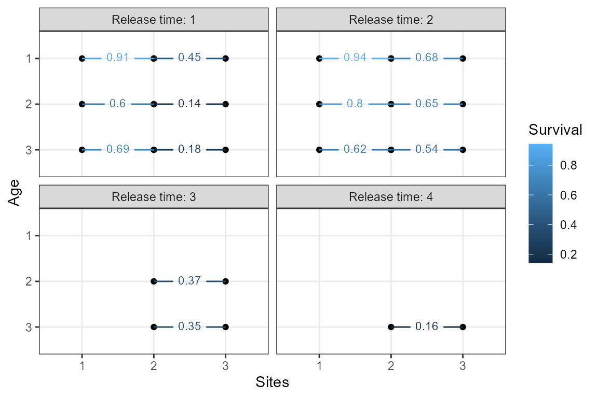
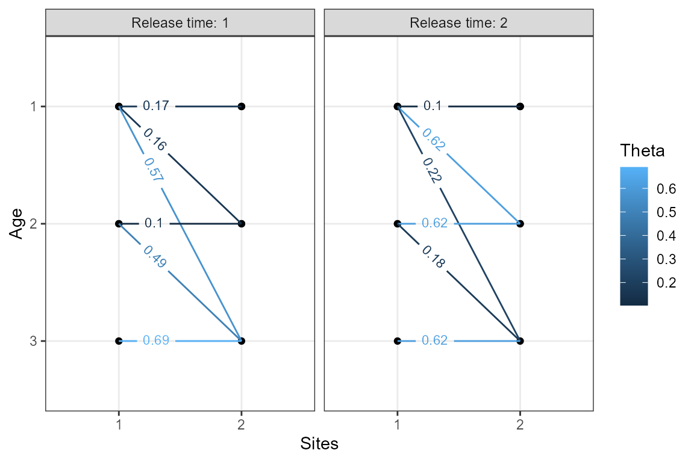

# Introduction to fitting age-specific space-for-time mark-recapture models

## 1. Introduction

The `space4time` package is used to fit an age-specific space-for-time
mark-recapture model. This vignette provides the basic details on
formatting data for the models and fitting the models. Load the
`space4time` package by running

``` r
library(space4time)
```

To briefly describe the purpose of these models and when then would be
useful, space-for-time substitutions are frequently used in
mark-recapture models for animals that migrate along a fixed path.
Instead of repeated observations over time, there are observations of
individuals as they pass fixed stations or sites. This is not a perfect
substitution, because the amount of time it takes individuals to move
between sites can vary. This model incorporates time and individual
ageclass into the space-for-time framework. Here, ageclasses are with
respect to time, so they are ages rather than stages like “juvenile” or
“adult”.

The development of this model was motivated by migrating juvenile
steelhead, which can be tagged as they exit rearing habitat. They can
wait up to a few years before migrating out to the ocean, passing by
observation stations (i.e. antennae that detect individuals with passive
integrated transponder tags). Their survival and movement depends on
age, so we made this model age-specific. However, ages are only measured
for a subset of individuals, so we use a sub-model for age and then
incorporate the uncertainty in age assignment into the mark-recapture
likelihood.

The mark-recapture likelihood is the product of the likelihood of the
observed data, where the probability that an individual transitions from
site `j` to site `k` given that it passed site `j` at time `s` and
during age `a1` is $`\Theta_{j,k,s,a_1,a_2,r,g}`$. The probability that
this individual is observed at site `k` is $`p_{j,k,t,a_1,a_2,r,g}`$.
The mark-recapture likelihood incorporates the probability age
assignments ($`\pi_{i,s,a}`$) for each individual $`i`$, where the
mark-recapture probabilities are weighted over the probability age
assignments
(i.e. $`\sum_{a1}{\Theta_{j,k,s,a_1,a_2,r,g} * \pi_{i,s,a1}}`$). A full
description of the likelihood and model implementation is given in
(forthcoming manuscript).

There are two additional indices for the $`Theta`$ and $`p`$ arrays:
initial release group $`r`$ and group $`g`$. The initial release group
is where individuals were first captured (or observed). The group $`g`$
allows for individual covariates to be included. The implementation here
uses formulas for the $`Theta`$ and $`p`$ parameters \[add link to
covariate vignette\]. The formula for detection probability $`p`$ is:

``` math

logit(p) = X\beta
```
where $`X`$ is a design matrix of data and $`\beta`$ are parameters.

The formula for $`\Theta`$ uses intermediary parameters for conditional
transition rates ($`\theta`$), which are the probability that an
individual transitions from site `j` to `k` during time `t` given that
it did not transition from site `j` to `k` in the previous time period.
This accounts for individuals that holdover between sites for a time
period or more.

``` math

\Theta_{j,k,s,a_1,a_2,r,g} = \theta_{j,k,s,a_1,a_2,r,g}\prod^{a2-1}_{v=a_1}{\theta_{j,k,s,a_1,v,r,g}}
```

``` math

logit(\theta_{j,k,s,a_1,a_2,r,g}) = Y\gamma
```
where $`Y`$ is a design matrix of data and $`\gamma`$ are parameters.

## 2. Data

To demonstrate the format that data need to be in to be read, data is
simulated using a built-in function

``` r
set.seed(1)
sim.dat <- sim_simple_s4t_ch(N = 800)

s4t_ch <- sim.dat$s4t_ch
```

This returns a capture history object (`s4t_ch`). The key pieces of data
of interest are the capture history, individual auxiliary data, and site
configuration.

### a. The capture history data:

Each row represents an observation or capture instance. There must be
four columns, described in the table below.

*Required columns:*

| Column  |                         Description                          |
|:--------|:------------------------------------------------------------:|
| id      |                     Uniquely identifier                      |
| site    |                      Observed site name                      |
| time    | Observation time period. Integer or date (converted to year) |
| removed |        Whether individuals were removed at this point        |

Example first 6 rows:

| id  | site | time | removed |
|:----|:-----|-----:|:--------|
| 1   | 1    |    2 | FALSE   |
| 1   | 2    |    3 | FALSE   |
| 2   | 1    |    1 | FALSE   |
| 2   | 2    |    1 | FALSE   |
| 3   | 1    |    1 | FALSE   |
| 3   | 2    |    2 | FALSE   |

### b. Individual auxiliary data

There must be example one row for each individual. There are three
required columns and any extra columns can be included. Order of columns
does not matter.

*Required columns:*

| Column   |                       Description                       |
|:---------|:-------------------------------------------------------:|
| id       |           Uniquely identifying code or number           |
| obs_time | Observed time period when auxiliary data were collected |
| ageclass |                    Integer ageclass                     |

Example first 6 rows:

|  id | obs_time |   FL | ageclass |
|----:|---------:|-----:|---------:|
|   1 |        2 | -2.8 |       NA |
|   2 |        1 | -1.5 |        2 |
|   3 |        1 |  0.9 |       NA |
|   4 |        1 |  4.9 |        3 |
|   5 |        2 | -3.6 |        1 |
|   6 |        1 |  4.8 |        3 |

### c. Site configuration

The site configuration is an object nested within the `s4t_ch` object. A
summary of the site configuration (`s4t_config` object) can be shown by
printing the object:

    #> Site and age transition configuration object
    #> 
    #> There are N = 3 with N = 1 sites with holdovers
    #> 
    #> Sites: 1, 2, 3
    #> 
    #> Sites with holdovers: 1
    #> 
    #> Site -> site:
    #> 1 -> 2
    #> 2 -> 3
    #> 3 -> 
    #> 
    #> Age range per site:
    #> 1: 1-3
    #> 2: 1-3
    #> 3: 1-3

There are three sites, where one of the sites has holdovers, meaning
that individuals can wait a time period or more between sites. The sites
are named `1`, `2`, and `3`. The site with holdovers is site `1`,
meaning that after individuals pass site `1`, they can wait a time
period or more before transitioning to the next site (site `2`). The
order and arrangement of the sites is shown by `Site -> site`, and the
possible age ranges that individuals can be in each site are shown by
`Age range per site`.

This object was generated using the following:

``` r
ex_config <- linear_s4t_config(sites_names = 1:3, # vector of site names
                               holdover_sites = 1,# which site (or sites) do 
                               # individuals holdover before continuing to the next site
                               min_a = c(1,1,1), # for each site, the minimum possible age
                               max_a = c(3,3,3)) # for each site, the maximum possible age
```

The
[`linear_s4t_config()`](https://ryanvosbigian.github.io/space4time/reference/linear_s4t_config.md)
function is used to create these `s4t_config` objects. For more complex
site configurations,
[`simplebranch_s4t_config()`](https://ryanvosbigian.github.io/space4time/reference/simplebranch_s4t_config.md)
or
[`s4t_config()`](https://ryanvosbigian.github.io/space4time/reference/s4t_config.md)
can be used.

### d. Creating the `s4t_ch` object

The `s4t_ch` object can be created using the elements from above:

``` r
ex_ch <- s4t_ch(ch_df = ch_df,
                aux_age_df = aux_df,
                s4t_config = ex_config)
```

## 4. Fit ageclass model

Prior to fitting the full model, the sub-model for ageclass can be fit
separately to select the best fitting model for ageclass. The
`fit_ageclass` function uses ordinal regression with the observed
age-class of individuals as a response. Covariates (which must be
included in the individual auxiliary data when creating the `s4t_ch`
object) can be included, using standard formula notation. We use the
logit link and transitions between age groups are sequential. The
threshold between each age group was estimated as parameters of the
model.

``` r
age_m1 <- fit_ageclass(age_formula = ~ 1,s4t_ch = s4t_ch)

age_m2 <- fit_ageclass(age_formula = ~ FL,s4t_ch = s4t_ch)

# note that obs_time is treated as a factor (see fit_ageclass documentation)
age_m3 <- fit_ageclass(age_formula = ~ FL + obs_time,s4t_ch = s4t_ch)
```

The models can be compared using AIC:

``` r
AIC(age_m1, 
    age_m2, 
    age_m3)
#>        df      AIC
#> age_m1  2 471.4208
#> age_m2  3 229.0453
#> age_m3  4 229.6865
```

The top model by AIC is `age_m2`.

## 5. Fit space-for-time mark-recapture model

There are two options for fitting space-for-time mark-recapture models,
implementations using Bayesian (`fit_s4t_cjs_rstan`) and maximum
likelihood (`fit_s4t_cjs_ml`) methods. As of now, the Bayesian
implementation is faster.

For the purposes of this example, the number of chains is set to 2
(recommend 3), the number of warmup iteration is 200 (recommend at least
500), and the number of total iterations is 600 (recommend at least 500
over the number of warmups).

The first three arguments are the formulas for detection probability
(`p`), conditional transition rates (`theta`), and ageclass. The
formulas allow for symbolic representation of the sub-models.

The formula for `p` below is `~ t`, which represents detection
probability varying by the time individuals pass sites. There is only
one site (site 2) where detection probability is estimated, because
detection is not estimated at the first site or last site (fixed to 1 at
the last site because it is not separable from transition rates). If
there were multiple sites where detection probability was estimated, the
equivalent formula would be `~ t * k`, which represents a different
detection probability at each site at each time period. A table showing
the meaning of each variable (`j`, `k`, `s`, `t`, `r`, `g`, `a1`, and
`a2`) is shown below.

The formula for `theta` below is `~ a1 * a2 * s * j`, which is the fully
saturated model for this scenario with different transition
probabilities for each combination of age, time, and site. The
transition probabilities for individuals from site `j` to site `k` are
conditioned on individuals not transitioning to site `k` in the previous
time period. This is the fully saturated model for `theta` because there
are no groups and because there is only one initial release site (site
1). If there were more than one initial release site, the full saturated
model would be `~ a1 * a2 * s * j * r`.

The argument `fixed_age == TRUE` allows for the ageclass model to be fit
separately and the output fed into the mark-recapture model. The output
is the estimated probabilities that individuals belong to each ageclass.
The mark-recapture model uses the probability age assignments to
integrate over the uncertainty in age.

| Variable |           Description           |
|:---------|:-------------------------------:|
| j        |          Release site           |
| k        |         Recapture site          |
| s        |          Release time           |
| t        |         Recapture time          |
| r        |      Initial release group      |
| g        |  Group (individual covariate)   |
| a1       |  Age during time s (“release”)  |
| a2       | Age during time t (“recapture”) |

``` r
m1 <- fit_s4t_cjs_rstan(
      p_formula = ~ t,
      theta_formula = ~ a1 * a2 * s * j,
      ageclass_formula = ~ FL,
      fixed_age = TRUE,
      s4t_ch = s4t_ch,
      chains = 2,
      warmup = 200,
      iter = 600
    )
#> 
#> SAMPLING FOR MODEL 's4t_cjs_fixedage_draft7' NOW (CHAIN 1).
#> Chain 1: 
#> Chain 1: Gradient evaluation took 0.002737 seconds
#> Chain 1: 1000 transitions using 10 leapfrog steps per transition would take 27.37 seconds.
#> Chain 1: Adjust your expectations accordingly!
#> Chain 1: 
#> Chain 1: 
#> Chain 1: Iteration:   1 / 600 [  0%]  (Warmup)
#> Chain 1: Iteration:  60 / 600 [ 10%]  (Warmup)
#> Chain 1: Iteration: 120 / 600 [ 20%]  (Warmup)
#> Chain 1: Iteration: 180 / 600 [ 30%]  (Warmup)
#> Chain 1: Iteration: 201 / 600 [ 33%]  (Sampling)
#> Chain 1: Iteration: 260 / 600 [ 43%]  (Sampling)
#> Chain 1: Iteration: 320 / 600 [ 53%]  (Sampling)
#> Chain 1: Iteration: 380 / 600 [ 63%]  (Sampling)
#> Chain 1: Iteration: 440 / 600 [ 73%]  (Sampling)
#> Chain 1: Iteration: 500 / 600 [ 83%]  (Sampling)
#> Chain 1: Iteration: 560 / 600 [ 93%]  (Sampling)
#> Chain 1: Iteration: 600 / 600 [100%]  (Sampling)
#> Chain 1: 
#> Chain 1:  Elapsed Time: 33.344 seconds (Warm-up)
#> Chain 1:                58.446 seconds (Sampling)
#> Chain 1:                91.79 seconds (Total)
#> Chain 1: 
#> 
#> SAMPLING FOR MODEL 's4t_cjs_fixedage_draft7' NOW (CHAIN 2).
#> Chain 2: 
#> Chain 2: Gradient evaluation took 0.002229 seconds
#> Chain 2: 1000 transitions using 10 leapfrog steps per transition would take 22.29 seconds.
#> Chain 2: Adjust your expectations accordingly!
#> Chain 2: 
#> Chain 2: 
#> Chain 2: Iteration:   1 / 600 [  0%]  (Warmup)
#> Chain 2: Iteration:  60 / 600 [ 10%]  (Warmup)
#> Chain 2: Iteration: 120 / 600 [ 20%]  (Warmup)
#> Chain 2: Iteration: 180 / 600 [ 30%]  (Warmup)
#> Chain 2: Iteration: 201 / 600 [ 33%]  (Sampling)
#> Chain 2: Iteration: 260 / 600 [ 43%]  (Sampling)
#> Chain 2: Iteration: 320 / 600 [ 53%]  (Sampling)
#> Chain 2: Iteration: 380 / 600 [ 63%]  (Sampling)
#> Chain 2: Iteration: 440 / 600 [ 73%]  (Sampling)
#> Chain 2: Iteration: 500 / 600 [ 83%]  (Sampling)
#> Chain 2: Iteration: 560 / 600 [ 93%]  (Sampling)
#> Chain 2: Iteration: 600 / 600 [100%]  (Sampling)
#> Chain 2: 
#> Chain 2:  Elapsed Time: 40.609 seconds (Warm-up)
#> Chain 2:                59.046 seconds (Sampling)
#> Chain 2:                99.655 seconds (Total)
#> Chain 2:
```

The results can be printed out. Check that the Rhat values are all below
1.1 (for proper convergence/mixing)

``` r
print(m1)
#> Inference for Stan model: s4t_cjs_fixedage_draft7.
#> 2 chains, each with iter=600; warmup=200; thin=1; 
#> post-warmup draws per chain=400, total post-warmup draws=800.
#> 
#>                    mean se_mean   sd  2.5%   25%   50%   75% 97.5% n_eff Rhat
#> theta_(Intercept) -1.59    0.01 0.25 -2.08 -1.76 -1.57 -1.41 -1.13   506 1.00
#> theta_a12         -1.70    0.02 0.52 -2.84 -2.04 -1.64 -1.34 -0.79   436 1.00
#> theta_a13         -1.09    0.02 0.52 -2.20 -1.41 -1.06 -0.72 -0.14   532 1.00
#> theta_a22          0.17    0.02 0.39 -0.58 -0.10  0.16  0.42  0.94   644 1.00
#> theta_a23          3.49    0.03 0.52  2.61  3.09  3.47  3.82  4.58   370 1.00
#> theta_s2          -0.60    0.02 0.38 -1.33 -0.86 -0.61 -0.34  0.17   541 1.00
#> theta_s3           0.88    0.02 0.39  0.16  0.62  0.88  1.14  1.69   631 1.00
#> theta_s4          -0.23    0.02 0.59 -1.41 -0.62 -0.22  0.17  0.88   720 1.00
#> theta_j2           1.37    0.02 0.53  0.30  1.00  1.38  1.71  2.44   550 1.00
#> theta_a12:a22      0.91    0.03 0.61 -0.21  0.47  0.89  1.32  2.11   437 1.01
#> theta_a12:s2       0.02    0.04 0.92 -2.08 -0.58  0.12  0.63  1.70   567 1.00
#> theta_a13:s2       0.01    0.04 0.92 -2.03 -0.57  0.07  0.64  1.62   514 1.00
#> theta_a12:s3       0.58    0.04 0.96 -1.03 -0.05  0.48  1.17  2.71   465 1.00
#> theta_a22:s2       2.83    0.02 0.51  1.77  2.49  2.84  3.16  3.86   547 1.00
#> theta_a23:s2       0.28    0.04 0.90 -1.31 -0.33  0.20  0.81  2.22   475 1.00
#> theta_a12:j2      -1.17    0.04 1.03 -3.43 -1.81 -1.16 -0.43  0.68   554 1.00
#> theta_a13:j2      -3.71    0.03 0.66 -5.08 -4.14 -3.69 -3.26 -2.47   668 1.00
#> theta_s2:j2        1.61    0.03 0.73  0.12  1.12  1.58  2.12  3.01   581 1.00
#> theta_a12:a22:s2   0.45    0.04 0.96 -1.28 -0.23  0.41  1.01  2.47   519 1.00
#> theta_a12:s2:j2   -1.68    0.05 1.12 -3.79 -2.42 -1.73 -0.98  0.53   603 1.00
#> theta_a13:s2:j2    0.40    0.03 0.85 -1.29 -0.19  0.39  1.01  2.11   599 1.00
#> p_(Intercept)      2.59    0.03 0.71  1.36  2.09  2.58  3.02  4.15   454 1.00
#> p_t2              -1.45    0.03 0.71 -3.05 -1.90 -1.42 -0.94 -0.14   435 1.00
#> p_t3              -0.51    0.04 0.79 -2.08 -1.06 -0.51  0.04  1.01   511 1.00
#> p_t4              -0.78    0.06 1.28 -2.87 -1.65 -0.94 -0.06  1.98   487 1.00
#> overall_surv[1]    0.91    0.00 0.04  0.83  0.88  0.91  0.93  0.97   617 1.00
#> overall_surv[2]    0.60    0.00 0.05  0.50  0.56  0.59  0.63  0.70   807 1.00
#> overall_surv[3]    0.69    0.00 0.06  0.59  0.65  0.69  0.72  0.81   770 1.00
#> overall_surv[4]    0.94    0.00 0.04  0.86  0.92  0.95  0.97  0.99   658 1.00
#> overall_surv[5]    0.80    0.00 0.05  0.71  0.77  0.80  0.84  0.89   780 1.00
#> overall_surv[6]    0.62    0.00 0.06  0.52  0.58  0.63  0.66  0.73   996 1.00
#> overall_surv[7]    0.45    0.00 0.11  0.23  0.37  0.45  0.52  0.67   784 1.00
#> overall_surv[8]    0.14    0.00 0.08  0.02  0.08  0.13  0.19  0.32   676 1.00
#> overall_surv[9]    0.18    0.00 0.05  0.10  0.15  0.18  0.21  0.28   717 1.00
#> overall_surv[10]   0.68    0.00 0.11  0.42  0.60  0.69  0.76  0.88  1056 1.00
#> overall_surv[11]   0.65    0.00 0.06  0.53  0.61  0.65  0.69  0.76   688 1.00
#> overall_surv[12]   0.54    0.00 0.05  0.45  0.51  0.54  0.58  0.63   761 1.00
#> overall_surv[13]   0.37    0.00 0.05  0.27  0.33  0.36  0.40  0.48   604 1.00
#> overall_surv[14]   0.35    0.00 0.05  0.25  0.31  0.35  0.38  0.44   813 1.00
#> overall_surv[15]   0.16    0.00 0.07  0.06  0.11  0.15  0.20  0.32  1025 1.00
#> cohort_surv[1]     0.17    0.00 0.04  0.11  0.15  0.17  0.20  0.24   523 1.00
#> cohort_surv[2]     0.16    0.00 0.04  0.10  0.14  0.16  0.19  0.25   848 1.00
#> cohort_surv[3]     0.57    0.00 0.05  0.47  0.54  0.57  0.61  0.66   541 1.00
#> cohort_surv[4]     0.10    0.00 0.03  0.05  0.08  0.10  0.12  0.17   943 1.00
#> cohort_surv[5]     0.49    0.00 0.05  0.39  0.46  0.49  0.53  0.59   980 1.00
#> cohort_surv[6]     0.69    0.00 0.06  0.59  0.65  0.69  0.72  0.81   770 1.00
#> cohort_surv[7]     0.10    0.00 0.03  0.06  0.08  0.10  0.12  0.17  1054 1.00
#> cohort_surv[8]     0.62    0.00 0.05  0.53  0.59  0.62  0.65  0.71   971 1.00
#> cohort_surv[9]     0.22    0.00 0.04  0.14  0.19  0.22  0.25  0.31   659 1.00
#> cohort_surv[10]    0.62    0.00 0.05  0.52  0.59  0.62  0.66  0.72   716 1.00
#> cohort_surv[11]    0.18    0.00 0.04  0.11  0.15  0.18  0.21  0.26   895 1.00
#> cohort_surv[12]    0.62    0.00 0.06  0.52  0.58  0.63  0.66  0.73   996 1.00
#> cohort_surv[13]    0.45    0.00 0.11  0.23  0.37  0.45  0.52  0.67   784 1.00
#> cohort_surv[14]    0.14    0.00 0.08  0.02  0.08  0.13  0.19  0.32   676 1.00
#> cohort_surv[15]    0.18    0.00 0.05  0.10  0.15  0.18  0.21  0.28   717 1.00
#> cohort_surv[16]    0.68    0.00 0.11  0.42  0.60  0.69  0.76  0.88  1056 1.00
#> cohort_surv[17]    0.65    0.00 0.06  0.53  0.61  0.65  0.69  0.76   688 1.00
#> cohort_surv[18]    0.54    0.00 0.05  0.45  0.51  0.54  0.58  0.63   761 1.00
#> cohort_surv[19]    0.37    0.00 0.05  0.27  0.33  0.36  0.40  0.48   604 1.00
#> cohort_surv[20]    0.35    0.00 0.05  0.25  0.31  0.35  0.38  0.44   813 1.00
#> cohort_surv[21]    0.16    0.00 0.07  0.06  0.11  0.15  0.20  0.32  1025 1.00
#> 
#> Samples were drawn using NUTS(diag_e) at Thu Dec  4 17:05:58 2025.
#> For each parameter, n_eff is a crude measure of effective sample size,
#> and Rhat is the potential scale reduction factor on split chains (at 
#> convergence, Rhat=1).
```

Evaluate traceplots of each estimated parameter:

``` r
traceplot(m1,pars = "theta")

traceplot(m1,pars = "^p") # regular expressions for all parameters that start with "p"
```

``` r
plotSurvival(m1)
```



``` r
plotTransitions(m1,textsize = 3, j == 1) # only include transitions that start from site 1
```


